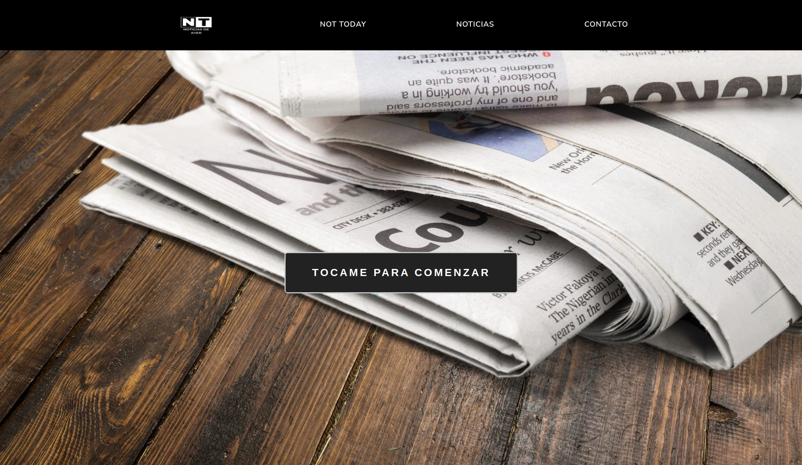

# <center> 📰 Not Today - Las Noticias de ayer 📰</center>

## 📑 Indice

- [Sobre el proyecto](#sobre-el-proyecto)

  - [Instalación y despliegue](#instalacion-y-despliegue)

  - [Tecnologías utilizadas](#tecnologias-utilizadas)

- [Requerimientos](#requerimientos)

- [Estructura de la página](#estructura-de-la-pagina)

- [Documentacion de React](#documentacion-de-react)

- [Rutas](#rutas)

- [Retos presentados](#retos-presentados)

- [Agradecimientos](#agradecimientos)

- [Futura implementaciones](#futuras-implementaciones)

- [Autor](#autor)

<br>

# Sobre el proyecto 🙇‍♀️

Proyecto de crear una App de noticias con llamada a una API

## Instalación y despliegue 🤖

Proyecto desplegado en [Vercel]!(https://news-app-three-mu.vercel.app/)

<br>

Primero instalamos react con la carpeta que contendrá el proyecto

```
npx create-react-app nombre-aplicacion
```

si clonas el repo, no se te olvide hacer:

```
npm install
```

<br>

Una buena idea es instalar esta extensión para acceder a los snippets de React

```
https://marketplace.visualstudio.com/items?itemName=dsznajder.es7-react-js-snippets
```

<br>

La siguiente herramienta de desarrollador nos permite ver las jerarquías de los componentes de React

```
https://chrome.google.com/webstore/detail/react-developer-tools/fmkadmapgofadoplj
bjfkapdkoienihi?hl=es
```

<br>

Deberemos installar el siguiente paquete para poder crear rutas en nuestros componentes

```
$ npm install react-router-dom@6
```

<br>

Instalamos el paquete sass para aplicar reglas anidadas y funciones con variables entre otras cosas

```
$ npm install sass

```

<br>

## Tecnologías utilizadas ⛏️

- HTML
- CSS
- Boostrap
- MDN for bootstrap
- Bootswatch
- Javascript
- React
- React-GlobalContext
- React-Router
- i18next (idioma)

<br>

# Requerimientos 🦂

- Un mini-proyecto de React para practicar todos los elementos básicos de React ya vistos.
- Implementar una "web de noticias"
- Uso de [NYT News API](https://developer.nytimes.com/apis).
- Uso del router React
- Utilizar componentes anidados (cabecera, home, pie de página, formulario, lista de noticias).
- Utilizar React Context

<br><br>

## Estructura de la página 🏗️

Cada ruta construye una página con tres componentes: La cabecera y el pie de página son comunes a
todas ellas. La Cabecera tiene tres botones, con `<Link />`, para acceder a las
tres rutas.

<br><br>

# Rutas

**Home** `/`

- Un navbar
- Una imagen central
- con un boton para proceder

<br>



# Documentación de React 👓

https://es.reactjs.org/docs/getting-started.html

<br>

# Retos presentados 💢

- Implementar una lista de noticias con axios fetch
- cambio de idioma (voluntario)
- maquetacion de la pagina
- sobrevivir una semana mas

<br>

# Agradecimientos 🤝

a todos mis compis y los profes. todos los dias absorvo ideas de ellos (COPY PASTEEEEEE).
ahora enserio... Gracias a las tardes de discord que hacen que puedan entender mejor el framework que hara que tenga un LAMBO.

<br>

# Futuras implementaciones 🚀

- ~~Implementar idiomas~~
- Añadir más estados
- perfeccionar el responsive

<br>

# Autor 🐧

David Ubeda Soriano

- https://github.com/dubesor22
